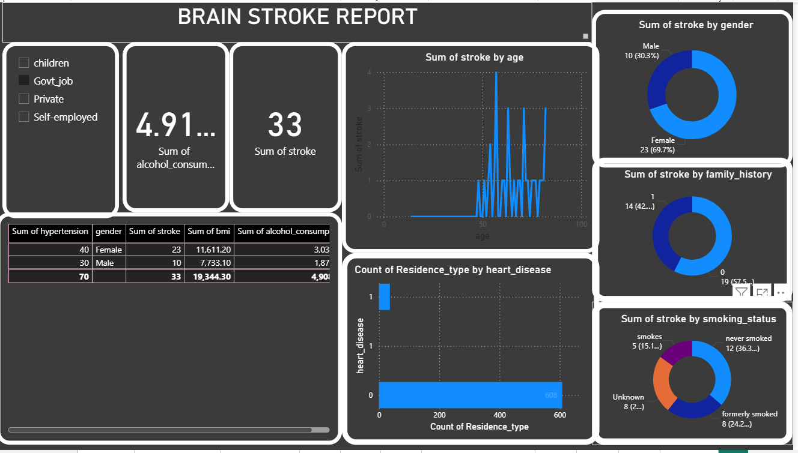

# 🧠 Brain Stroke Detection - Power BI Analytics Dashboard

This project is an **interactive analytics dashboard built using Power BI**, focused on analyzing and visualizing key insights from a brain stroke detection dataset. The goal of this dashboard is to assist in understanding the patterns, correlations, and risk factors associated with brain strokes, enabling better decision-making in healthcare and preventive diagnostics.

## 📊 Dashboard Highlights

The Power BI dashboard includes:

- **Overview KPIs**: Total patients, stroke cases, average age, gender distribution
- **Demographics Analysis**: Distribution by gender, age groups, and work type
- **Health Risk Indicators**:
  - Hypertension, heart disease, smoking status
  - Cholesterol levels, physical activity, and alcohol consumption
- **Stroke Correlation**: Visual correlation between risk factors and stroke occurrence
- **CRP & Family History**: Insight into biomarkers (C-Reactive Protein) and hereditary factors
- **Predictive View (Optional)**: Integration-ready layout for ML prediction scores

## 📁 Dataset Description

The dataset includes the following features:

- `gender`
- `age`
- `hypertension`
- `heart_disease`
- `ever_married`
- `work_type`
- `Residence_type`
- `avg_glucose_level`
- `bmi`
- `smoking_status`
- `stroke` (target)
- Additional attributes:
  - `cholesterol_level`
  - `physical_activity_level`
  - `alcohol_consumption`
  - `family_history`
  - `C_reactive_protein`

## 🔧 Tools Used

- **Power BI Desktop**
- **Microsoft Excel/CSV for Data Preparation**
- **Data Cleaning using Power Query**
- Optional: Python/R scripting within Power BI

---

## 🎯 Objectives

- Explore the risk distribution across age, lifestyle, and medical history
- Visualize trends and detect high-risk clusters
- Provide a clear and interactive tool for non-technical stakeholders
- Serve as a foundation for integrating ML-based prediction models

## 🛠️ How to Use

1. **Open Power BI Desktop**
2. **Load the provided dataset** (`brain_stroke.csv`)
3. **Refresh and view the dashboard** – slicers and filters allow deep dives into specific segments
4. **Customize the visuals** to add predictive layers or regional filters if required

## 📷 Sample Screenshots
## 📷 Dashboard Preview

### 🧠 Main Dashboard

